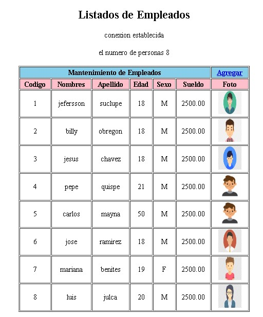

# **Jefer sc** 
## **Listado php Con imagenes almacenadas**
*Listado de empleados con php ,mostrando las imagenes almacenadas dentro de carpetas locales.*
[Ver demo ->](https://github.com/jefersc/Listadophp-con-imagenes-almacenadas.git)

## **Listado**

 
<h1 align="center"><strong> 📝 Listado:</strong></h1>
 

